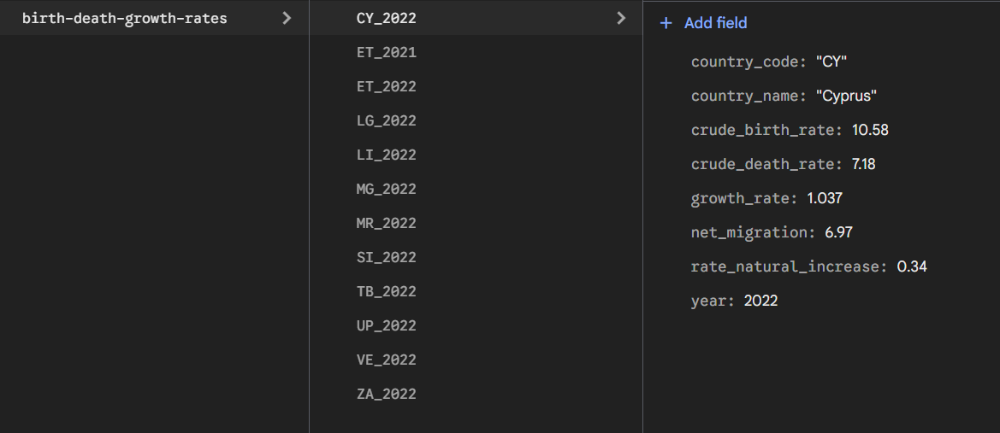

# International Population Dynamics

Welcome to the repository for the **SOS2526-12** group.

## Team
* **Javier** - [@javier12012001](https://github.com/javier12012001)
* **Lucca** - [@Lucca-Pereira-2](https://github.com/Lucca-Pereira-2)
* **Francisco** - [@CMediavilla16](https://github.com/CMediavilla16)

## Project Description
Our project analyzes the correlation between population growth and social structure. We aim to understand global demographic trends by utilizing international data sources focused on:

* **Birth & Death Rates:** Analyzing natural growth factors.
* **Fertility by Age:** Understanding reproductive trends across different age groups.
* **Population Structure:** Breaking down demographics by sex and age to visualize population pyramids.

## Sources & Data
The project relies on Open Data from international census records (Kaggle/Census Bureau), specifically tracking vital statistics and population breakdowns.

## Repository
* https://github.com/gti-sos/SOS2526-12

## URL
* https://sos2526-12.onrender.com

## API V1:
- https://sos2526-12.onrender.com/api/v1/age-specific-fertility-rates/docs (Developed by Francisco de Paula Mediavilla García)
- https://sos2526-12.onrender.com/api/v1/birth-death-growth-rates/docs (Developed by Lucca Pereira)
- https://sos2526-12.onrender.com/api/v1/mid-population-ages/docs (Developed by Javier Jiménez)

## API V2:
- https://sos2526-12.onrender.com/api/v2/age-specific-fertility-rates/docs (Developed by Francisco de Paula Mediavilla García)
- https://sos2526-12.onrender.com/api/v2/birth-death-growth-rates/docs (Developed by Lucca Pereira)
- https://sos2526-12.onrender.com/api/v2/mid-population-ages/docs (Developed by Javier Jimenez Garcia)

## Puntos extra Lucca Pereira Heasman
* Hugging Face (Render alternative): https://lucperhea-sos2526-12.hf.space
* JWT authentication in backend
* Auth0 with social login: https://sos2526-12.onrender.com/birth-death-growth-rates
* Firebase implementation: 

## Badges

---
*Repository for the Service-Oriented Systems course (2025/2026).*
